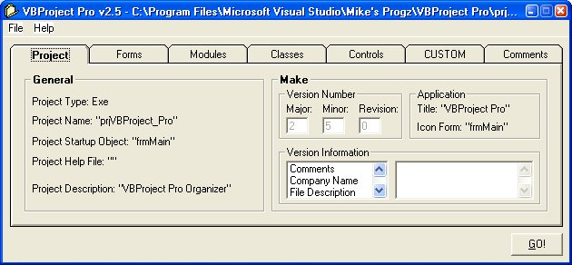



## VBProject Pro v2\.5 BACK AND BETTER THAN EVER\!\!

### Description

BACK AND BETTER THAN EVER!! A MUST NEED FOR VB PROGRAMMERS. QUICKLY AND EASILY ORGANIZE YOUR VB PROJECTS AND FILES! Not to mention the ability to screen for CUSTOM file types (extensions) and move them to specified directories as well. VBProject Pro manages and organizes your visual basic projects quickly and easily. You specify the path to your project file (.VBP) and it does the rest. It will automatically gather all your forms, modules, classes, and user controls and move them into the directories you specify! You can also assign CUSTOM rules the program will screen for. Example: you set a rule for .bmp's and assign it to the folder "%Project Dir%\Images\" and all the .bmp's in the projects directory will be automatically moved. Set as many rules as you want! A TON OF BUGS FIXED AND NEW FEATURES ADDED.....FIXED THE PESKY OCX PROBLEM EVERYONE WAS GETTING, SORRY GUYS MY BAD....ADDED A BACKUP FEATURE THAT BACKS UP ANY FILE IT MOVES OR EDITS (WHILE STILL RETAINING DIRECTORY STRUCTURE)....AND ALSO WHEN CREATING THE NEW VBP FILE IT WRITES THE RELATIVE PATH AS OPPOSED TO THE DIRECT PATH THAT IT USED TO DO. SOME OF THE CODE WAS BORROWED, CREDITS GIVIN TO THEM IN THE CODE. I THINK I HAMMERED OUT PRETTY MUCH ALL OF THE BUGS, ONLY THING LEFT IS THE COMMENT SYSTEM I THINK, THANX FOR THE PATIENCE GUYS AND REMEBER TO VOTE!!!
 
### More Info
 

             |
---                |---
**Submitted On**   |2004-01-28 22:28:52
**By**             |[Mike Davis](https://github.com/Planet-Source-Code/PSCIndex/blob/master/ByAuthor/mike-davis.md)
**Level**          |Advanced
**User Rating**    |3.8 (19 globes from 5 users)
**Compatibility**  |VB 6\.0
**Category**       |[VB function enhancement](https://github.com/Planet-Source-Code/PSCIndex/blob/master/ByCategory/vb-function-enhancement__1-25.md)
**World**          |[Visual Basic](https://github.com/Planet-Source-Code/PSCIndex/blob/master/ByWorld/visual-basic.md)
**Archive File**   |[VBProject\_1701031282004\.zip](https://github.com/Planet-Source-Code/mike-davis-vbproject-pro-v2-5-back-and-better-than-ever__1-51327/archive/master.zip)

